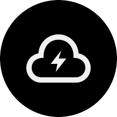

<p align="center">
  
</p>

# Sharebox
> A simple webapp to enable sharing files from an SFTP server via links. Perfect for agencies.

## Motivation
Do you have clients that just won't *get* how FileZilla works? Do you hate providing phone support for them?  
That's exactly what I experienced. After a lot of frustration and glancing at WeTransfer, I decided to build something on my own.

## How it works / Features
 - **Stream large files:** The Sharebox connects to your (S)FTP server internally and streams files to clients from there. That way, it can easily transfer huge files - I've had no problems with a 200GB archive, for example.
 - **Choose files using a file explorer:** No copy-pasting file paths anymore. On creating a share, the app will present you a file explorer to choose your file on the remote FTP server.
 - **Customize download pages:** You can create reusable templates for downloads that control the entire page displayed, period. Customize your download pages into every detail and for every occasion, or just use the beautiful default template.
 - **Expire or password-protect shares:** For every share created, you can optionally set an expiration date or a password to make sure it only reaches the intended recipient.
 - **Download tickets:** On visiting a landing page, a ticket is generated. This prevents direct links to your files.
 - **Customize the backend:** The Sharebox lets you upload your own logo and primary colour which are also available in your templates.

**You can view a bunch of screenshots here: https://imgur.com/a/5jVfx2U** 

## Installation
To install Sharebox, clone this repository:

```bash
git clone https://github.com/Radiergummi/sharebox
```

Copy the `.env.example` file to `.env` and modify the configuration. There are a few settings you'll need to set:

```
APP_NAME=Sharebox

# Set the download ticket expiration in minutes here
DOWNLOAD_EXPIRATION=30

# Configure the database at your will
DB_CONNECTION=sqlite
DB_HOST=127.0.0.1
DB_PORT=3306
DB_DATABASE=./database/db.sqlite
DB_USERNAME=homestead
DB_PASSWORD=secret

# Configure this for your (S)FTP server. Protocol must be FTP or SFTP.
FTP_PROTOCOL=sftp
FTP_SERVER=your.ftp.server.url
FTP_PORT=22
FTP_USER=ftp_username
FTP_PASSWORD=ftp_password

```
Initialize the database:

```bash
php ./artisan migrate
php ./artisan db:seed
```

This will prepare the database, create all default templates and a default user. 

Congrats! You can now login using the following credentials:  
Username: `admin`
Password: `turkcobaltmagazinestash` ([XKCD 936](https://xkcd.com/936))

### Localization
The app is fully localizable. Currently, there are complete translations for English and German. To create one for your language, simply copy the English translation directory to one named like your languages code: 

```bash
cp -R ./resources/lang/en ./resources/lang/<code>
```

### Webserver configuration
This is a pretty standard Laravel app, so you should take a look at [their documentation on webserver configuration](https://laravel.com/docs/5.6/installation#web-server-configuration) if you need help.

### State of development / Contributing
The Sharebox works fine at this point (I'm using it in production), but there may be some edges you find to be too rough. In that case, please don't hesitate to submit issues or PRs.
